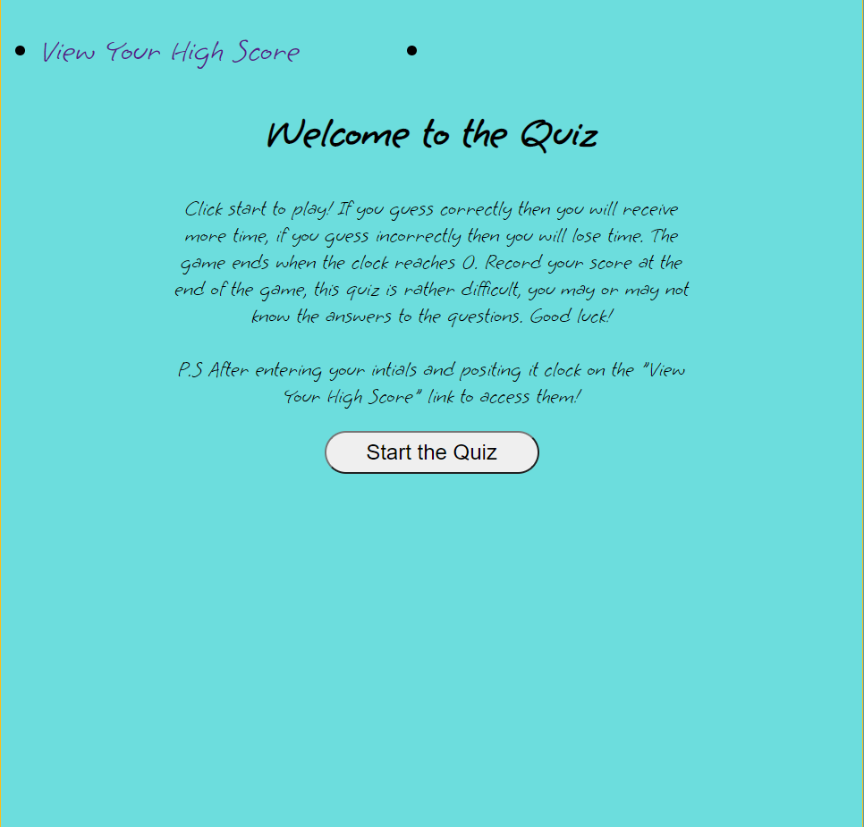

# Web-API-Quiz

## Website URL
https://abhi20220.github.io/Web-API-Quiz/

## Goals
I built this project because the client wanted a web based API Quiz which has the ability to contain data through the use of "local storage". This is evident on the "high-score" HTML page.

## Problems and Solutions

A problem I faced when creating this project resides within the synchronization between both HTML sites. This is because if line of code was wrong whether it be letters, syntax, IDs or classes, it would affect the functionality of the other HTML document. This can render multiple sections of the Javascript useless.  To solve this problem I made sure that before proceeding to my next code/function, I ensured that everything is working up until that point. This decreases backtracking and increases efficiency.

## Completed Requirements 

```
1.  When the user clicks on the start button the timer begins and a question is presented
2. When the user answers a question they will be prompted with a statement saying they're correct and in which case they will get additional time. 
3. When the user answers a question and the answer is wrong, time is subtracted from the clock until the right answer is chosen or if the timer runs out
4. If the user answers all the questions or if the timer reaches 0 the game is over
5. When the game is over the user can save their initals and their score(time)
```

## Web Page Overview
The following images show the web application's appearance and functionality:




The following are prompts, alerts and points of interests for the client


